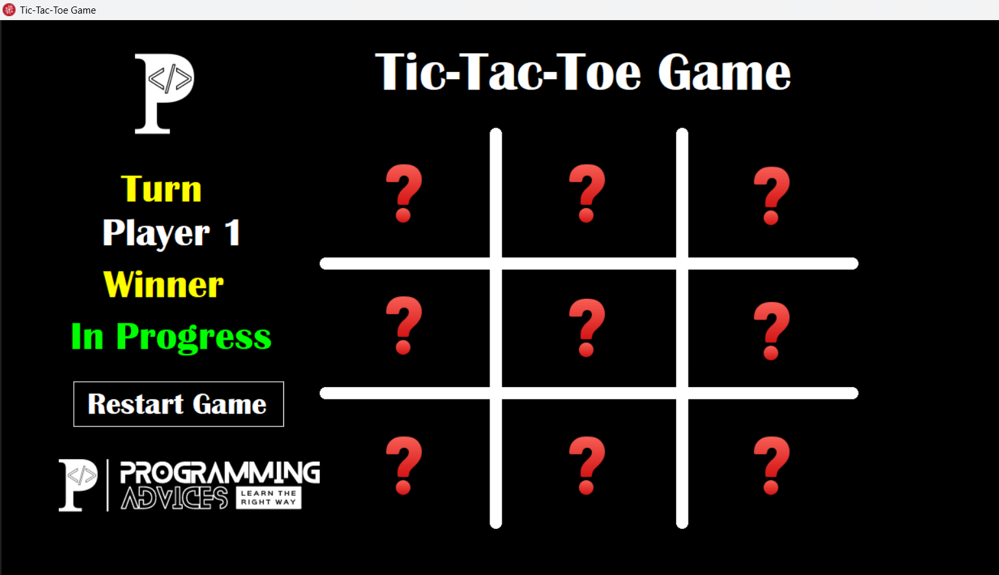
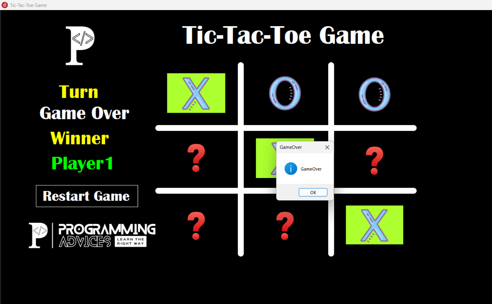

# 🎮 Tic-Tac-Toe (XO Game)

A desktop Tic-Tac-Toe (XO) game developed using **C#** and **Windows Forms** to practice application logic, event-driven programming, and game state management.

---

## ✨ Features

- 🎮 Two-player gameplay
- ✅ Automatic winner detection
- 🤝 Draw detection
- 🔄 Turn management
- 🚫 Prevents overwriting occupied cells
- 🏆 Highlights the winning combination
- 🔁 Restart game functionality
- 🎨 Clean and interactive user interface

---

## 🛠️ Technologies Used

- C#
- .NET Framework
- Windows Forms
- Visual Studio

---

## 📚 What I Learned

- Object-Oriented Programming (OOP)
- Event-Driven Programming
- Windows Forms Development
- Game State Management
- Enums & Structs
- Problem Solving

---

## 📸 Screenshots

### 🏠 Home Screen

### 🏆 Winner Screen

---

## 👨‍💻 Author

**Kerolos Mamdouh**

- GitHub: https://github.com/kerolos5mamdouh
- LinkedIn: https://www.linkedin.com/in/kerolos-mamdouh-98601237b/

---

⭐ If you like this project, don't forget to give it a **Star**.
